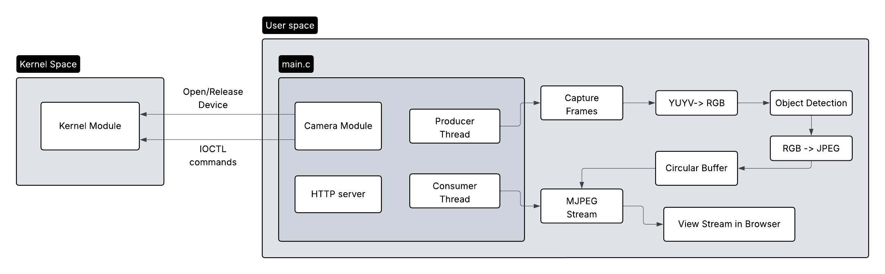

## 📸 Real-Time Camera Streaming with Object Detection
A real-time camera streaming system built on a Raspberry Pi that integrates a custom Linux kernel module, a multithreaded user-space capture pipeline, MJPEG HTTP streaming, and optional on-device object detection using TensorFlow Lite.

This project demonstrates end-to-end system design across kernel space and user space. It combines Linux interfaces (V4L2, IOCTL, MMAP) with concurrent data pipelines and computer vision inference.

💡 **Additional Notes**
Each key feature includes a link to **in-depth implementation notes** that describe how the module was designed and built.

### 🌿 Branches 
- `main` - Stable, fully integrated version of the project
- `stream` - Core camera capture and MJPEG streaming pipeline
- `stream_detect` - Streaming pipeline with on-device object detection
- `gh-pages` - Generated documentation hosted via github pages

### 📝 Documentation 
The project includes **comprehensive Doxygen documentation** covering:
- Modules
- Functions
- Classes and detailed usage    

👉 Explore the generated docs: [Doxygen Documentation](https://hajjsalad.github.io/RaspberryPi-Cam-Streamer/html/index.html)      
👉 Explore how the documentation was structured and written: [Notes on Notion](https://www.notion.so/hajjsalad/Doxygen-Documentation-2dea741b5aab809989afdaf9d198430b)

### 🗝️ Key Features  
✅ **Custom Linux Kernel Module**  [Notes on Notion](https://www.notion.so/hajjsalad/Cam-Stream-Kernel-Module-2cca741b5aab80e1bddbe204e5e99eae)  

- Character device driver exposing camera control and LED status signaling via `ioctl`
- Well-defined kernel ↔ user-space interface with minimal surface area
- GPIO-driven LED indicators reflecting real-time camera streaming state

`GPIO` · `IOCTL` · `Character device` · `Linux kernel` · `kernel ↔ user space interface`

✅ **V4L2-Based Camera Pipeline**  [Notes on Notion](https://www.notion.so/hajjsalad/V4L2-Streaming-Pipeline-2cca741b5aab80be8b30e62d9311b929)

- Camera configuration using V4L2 API, including format negotiation and stream parameters
- Buffer allocation and zero-copy frame access via memory mapping I/O (MMAP)
- Continuous frame capture with explicit buffer dequeue and re-queue operations   

`V4L2` · `Camera drivers` · `MMAP` · `Buffer management` · `Video streaming`

✅ **Multithreaded Producer-Consumer Architecture**
- Dedicated producer thread captures frames from the camera pipeline
- Consumer thread streams encoded frames to connected HTTP clients
- Lock-protected circular buffer ensure safe, low-latency data exchange between threads    

`Mutex` · `Semaphore` · `Circular buffers` · `Multithreading` 

✅ **MJPEG HTTP Streaming**  [Notes on Notion](https://www.notion.so/hajjsalad/MJPEG-HTTP-Streaming-2cca741b5aab80d9ab6beddf8d86db00)

- Lightweight HTTP server
- Multipart MJPEG streaming to browsers

✅ **Real-Time Object Detection**  [Notes on Notion](https://www.notion.so/hajjsalad/Object-Detection-2d2a741b5aab80ac958fc72ffb4de8a4)
- TensorFlow Lite inference on captured frames
- Designed for edge deployment
---
### 🧶 Threading Model
- Producer Thread
  - Continously capture frames using V4L2
  - Creates the buffer
  - Converts raw frames and pushes them into a circular buffer
  - Signals frame availability using a semaphore
- Consumer Thread
  - Waits on the semaphore for available frames
  - Retrieves JPEG frames from the circular buffer
  - Streams JPEG frames to connected HTTP clients   
  - Frees the buffer
  
This design allows for **producer thread** to run continously, while a new **consumer thread** is spawned per client.

### 🏗️ High Level Flow

---
### ⚙️ Hardware
- **Raspberry Pi 5** - primary embedded platform for kernel and user-space execution
- **Logitech C270 USB webcam** - V4L2-compatible video capture device
- **GPIO-connected RGB LED** - real-time system status indication
  - RED: idle state or error condition
  - GREEN: active camera streaming

### 🧱 Build and Run
- `make module`: Build the kernel module  
- `make user`: Build the user-space application  
- `make`: Build both the kernel module & user-space application  
- `sudo insmod kernel/cam_stream.ko`: Insert the kernel module  
- `sudo ./camera_client`: Start the camera streaming application  
- `http://<raspberry-pi-ip>/stream`: Open broswer and view the stream  

### 📂 Repository Structure
```
📁 pi_live_stream/
│
├── docs/                     # Doxygen-generated documentation
│
├── kernel/                   # Linux kernel module
│   ├── cam_stream.c          # Character device + ioctl implementation
│   ├── cam_stream_ioctl.h    # Shared ioctl interface (kernel ↔ user)
│   └── Makefile              # Kernel module build rules
│
├── src/                      # User-space application
│   ├── camera/               # V4L2 camera capture & buffer management
│   │   ├── camera.c
│   │   └── camera.h
│   │
│   ├── cb/                   # Lock-protected circular buffer
│   │   ├── circular_buffer.c
│   │   └── circular_buffer.h
│   │
│   ├── detection/            # Real-time object detection (TFLite)
│   │   ├── detection.cpp
│   │   ├── detection.h
│   │   └── models/
│   │       └── detect.tflite
│   │
│   ├── http/                 # HTTP server + MJPEG streaming
│   │   ├── http_server.c
│   │   ├── http_server.h
│   │   ├── mjpeg_stream.c
│   │   └── mjpeg_stream.h
│   │
│   ├── image/                # Image processing & encoding
│   │   ├── image_encoder.c
│   │   ├── image_encoder.h
│   │   ├── image_processor.c
│   │   └── image_processor.h
│   │
│   └── main.c                # Application entry point & thread orchestration
│
├── README.md                 # Project overview & usage
└── Makefile                  # Builds kernel module and user-space client
```
